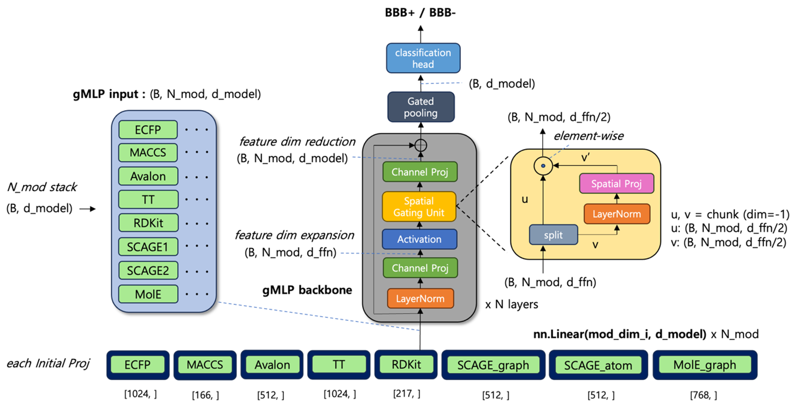

# GateMol-BBB

Adaptive multimodal integration for blood–brain barrier permeability (BBBP)
prediction. GateMol-BBB is a gMLP-based model that fuses molecular fingerprints,
RDKit descriptors, and pretrained graph encoders (SCAGE, MolE) through a gated
mixing pooler discovered by an AutoResearch architecture search.



Each modality is projected to `d_model`, stacked into `N_mod` tokens, mixed by a
gMLP backbone with a Spatial Gating Unit, gated-pooled to a single vector, and
classified as BBB+ / BBB−. The per-modality input dimensions above match
`gatemol_bbb.features` exactly (RDKit 2024.9.6 → 217 descriptors).

This repository releases the two final models from the study:

| Protocol | Feature combination | Training data | Evaluation | Final architecture |
|---|---|---|---|---|
| **Protocol I** (initial)  | MACCS + Avalon + RDKit + MolE | internal only, 8:1:1 split | internal test / external / holdout | gMLP + attention pooling + Phase-2 HPO |
| **Protocol II** (refined) | MACCS + SCAGE1 + MolE         | internal + external integrated, 8:2 split | similarity-controlled holdout (888 / nn05 329) | gMLP + single-head attn-biased pool (iter198) |

Holdout subsets are nested: `329 ⊆ 888 ⊆ 1089`. Cross-protocol comparison uses the
common `888 / 329` holdout. All results are reported as **per-seed mean ± std**
over 10 seeds `[42, 100, …, 900]`, scaffold split.

## Repository layout

```
src/gatemol_bbb/
  models/      final architecture for each protocol
  features/    embedding / descriptor extraction (RDKit, SCAGE, MolE)
  data.py      split & holdout-subset construction
  train.py     training entry point (--protocol {1,2})
  evaluate.py  per-seed + soft-vote evaluation
scripts/       shell wrappers for feature extraction / train / eval
data/          lightweight splits & holdout labels (large arrays via Zenodo)
docs/          protocol definitions, model card, reproducibility notes
environment/   pinned conda / pip environment
```

## Model weights & precomputed features

Trained weights (10-seed, both protocols) and precomputed feature caches are
**not** stored in git. They are archived on Zenodo — see `data/DOWNLOAD.md` for the
DOI and layout.

## Reproducibility

RDKit descriptor count is version-sensitive (2024.9.6 → 217 descriptors). Pin the
environment exactly as in `environment/environment.yml`. See `docs/reproducibility.md`.

## Citation

The weights and evaluation records are archived on Zenodo:

> Kim, M. *GateMol-BBB: trained model weights and evaluation records for gated
> multi-modal blood–brain barrier permeability prediction* (v1.0.0) [Data set].
> Zenodo. https://doi.org/10.5281/zenodo.22119636

Cite the all-versions DOI above (`10.5281/zenodo.22119636`) rather than the
v1.0.0 DOI (`10.5281/zenodo.22119637`) unless you mean that specific version.
The deposit is pending publication; the DOIs resolve once it is released.

> _TODO: add the manuscript citation once available, and record it on the Zenodo
> deposit as an `isSupplementTo` related identifier._

## License

_TODO: choose a license (code) and confirm dataset redistribution terms._ See `data/README.md`.
